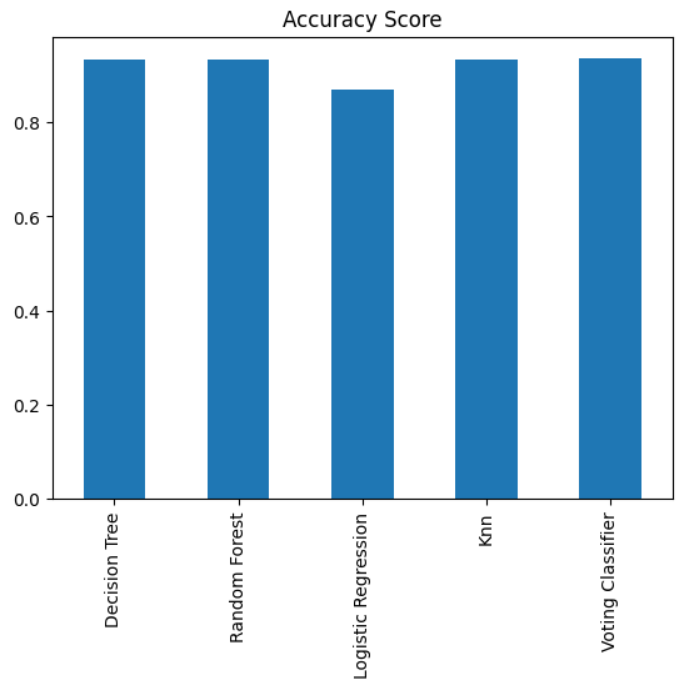
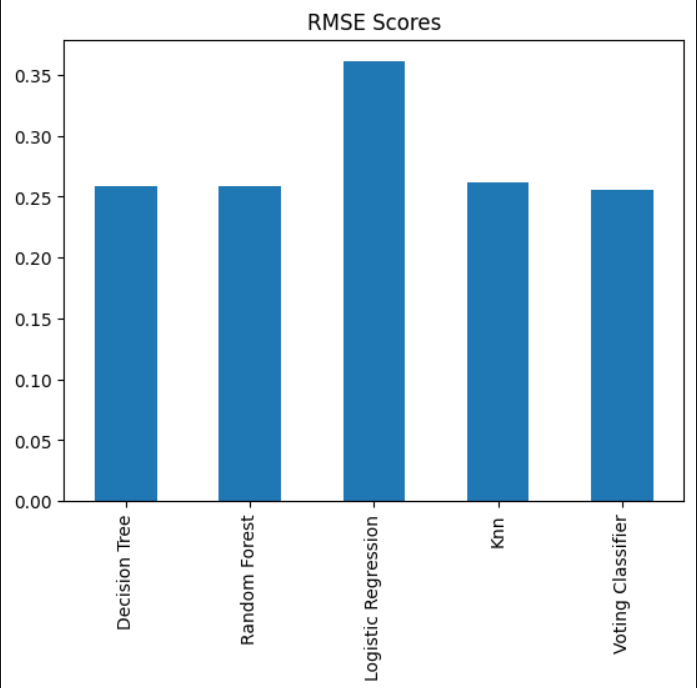

# 📉 Customer Churn Prediction

A machine learning project to predict customer churn in the telecom industry using multiple classification algorithms.

---

## 📌 Problem Statement

Customer churn (when customers leave a service) is a major challenge in industries like **telecom, banking, and e-commerce**. Acquiring new customers costs significantly more than retaining existing ones. This project builds a model to **identify at-risk customers** before they leave.

---

## 📊 Dataset

- **File:** `data/Customer_churn.csv`
- **Instances:** 3,150
- **Features:** 14

| Feature | Description |
|---|---|
| Call Failures | Number of failed calls |
| Complains | Binary (0 = no complaint, 1 = has complaint) |
| Subscription Length | Total months subscribed |
| Charge Amount | Ordinal (0 = lowest, 9 = highest) |
| Seconds of Use | Total seconds of calls |
| Frequency of Use | Total number of calls |
| Frequency of SMS | Total number of SMS messages |

---

## 🤖 Models Used

- Logistic Regression
- Decision Tree
- K-Nearest Neighbors (KNN)
- Random Forest
- Voting Classifier (Ensemble)

---

## 📈 Evaluation Metrics

- Accuracy
- Precision
- Recall
- F1-Score
- Confusion Matrix

---

## 🛠️ Tech Stack

- Python
- Pandas & NumPy
- Scikit-learn
- Matplotlib / Seaborn
- Jupyter Notebook

---

## ⚙️ Setup

### 1. Clone the repo
```bash
git clone https://github.com/arsalwnn/customer-churn-prediction.git
cd customer-churn-prediction
```

### 2. Install dependencies
```bash
pip install -r requirements.txt
```

### 3. Run the notebook
```bash
jupyter notebook notebook/customer_churn_analysis.ipynb
```

---

## 📁 Project Structure

```
customer-churn-prediction/
│
├── data/
│   └── Customer_churn.csv
│
├── notebook/
│   └── customer_churn_analysis.ipynb
│
├── README.md
├── requirements.txt
└── .gitignore
```
## 🏆 Results

| Model | Accuracy | RMSE |
|---|---|---|
| Decision Tree | 93.33% | 0.258 |
| Random Forest | 93.33% | 0.258 |
| Logistic Regression | 86.98% | 0.361 |
| KNN | 93.17% | 0.261 |
| Voting Classifier | **93.49%** | **0.255** |

> Best model: **Voting Classifier** with 93.49% accuracy
---
## 📊 Model Comparison




---
## 👤 Author

**AmirArsalan Rezaianzadeh**  
[GitHub](https://github.com/arsalwnn)
